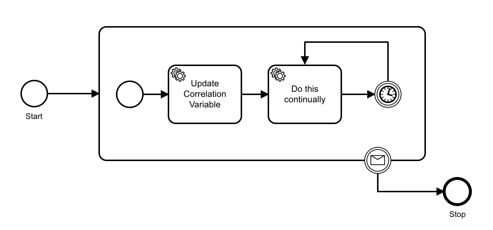
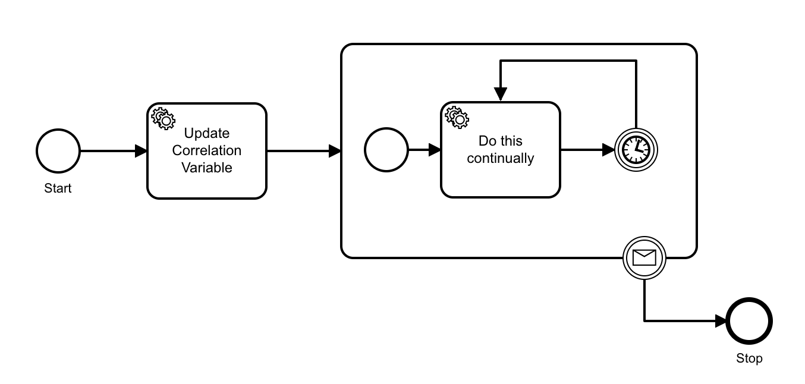

# Zeebe Message Correlation

Message correlation is a powerful feature in Zeebe. It allows you to target a running workflow with a state update from an external system asynchronously. 

This tutorial uses the JavaScript client, but it serves to illustrate message correlation concepts that are applicable to all language clients.

If you are doing this exercise on Camunda SaaS, remember to set the environment variables with your client credentials in each terminal window; and you will use Operate in your Camunda SaaS cluster, rather than Simple Monitor.

## Workflow

Here is the basic example from [the Camunda 8 docs](https://docs.camunda.io/docs/product-manuals/concepts/messages):


Use the [Camunda Modeler](https://camunda.com/download/modeler/) to open the [test-messaging](bpmn/test-messaging.bpmn) file in this project.

Click on the intermediate message catch event to see how it is configured:


A crucial piece here is the _Subscription Correlation Key_. In a running instance of this workflow, an incoming "_Money Collected_" message will have a `correlationKey` property:

```java
client.newPublishMessageCommand()
    .messageName("Money Collected")
    .correlationKey("345")
    .variables(new HashMap<String, String>() {
        {
            put("paymentStatus", "paid");
        }
    })
    .send()
    .join();
```

 The value of the message `correlationKey` is matched against running workflow instances, by comparing the supplied value against the `orderId` variable of running instances subscribed to this message. This is the relationship established by setting the Subscription Correlation Key to `orderId` in the message catch event in the BPMN.

## Running the demonstration

 - Clone this repository.

 - In the Java subdirectory, compile the project:
 ```
mvn package
 ```

 - Optional: In another terminal start Camunda 8 using [](https://github.com/camunda/camunda-platform).

 - Set the environment variables that correspond to your Camunda 8 deployment. If you started Camunda 8 using docker, you can source the environment variables in `docker-selfmanaged.env`.

 - Run the compiled project: 

 ```
 java -jar target/zeebe-java-1.0-SNAPSHOT.jar
 ```

You will see the entire process run through. 


## Message Buffering

Messages are buffered on the broker, so your external systems can emit messages before your process arrives at the catch event. The amount of time that a message is buffered is configured when publishing the message from the client library.

For example, to send a message that is buffered for 10 minutes with the JavaScript client:

```java
client.newPublishMessageCommand()
    .messageName("Money Collected")
    .correlationKey("345")
    .variables(new HashMap<String, String>() {
        {
            put("paymentStatus", "paid");
        }
    })
    .timeToLive(Duration.ofSeconds(30))
    .send()
    .join();
```

## Common Mistakes

A couple of common gotchas:

- The `correlationKey` in the BPMN message definition XML ("Subscription Correlation Key" in the modeler) is the name of the workflow variable to match against. The `correlationKey` in the message is the concrete value to match against that variable in the workflow instance. 

 - An important thing to know is that the message subscription _is not updated after it is opened_. That is not an issue in the case of a message catch event, however for boundary message events (both interrupting and non-interrupting) the subscription is opened _as soon as the token enters the bounding subprocess_. If any service task modifies the `orderId` value inside the subprocess, the subscription will not be updated.  
 
 For example, the interrupting boundary message event in the following example will not be correlated on the updated value, because the subscription is opened when the token enters the subprocess, using the value at that time:
 
 
 
 
 If you need a boundary message event correlated on a value that is modified somewhere in your process, then put the boundary message event in a subprocess after the task that sets the variable. The message subscription for the boundary message event will be opened when the token enters the subprocess, with the current variable value.

 

## Summary

Message Correlation is a powerful feature in Zeebe. Knowing how messages are correlated, and how and when the message subscription is created is important to design systems that perform as expected.

